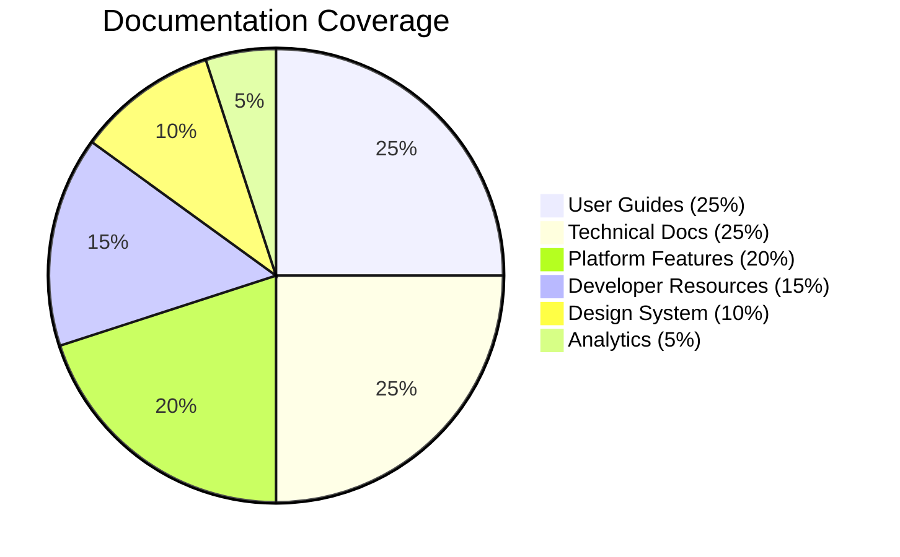

# Akkuea Documentation

_Empowering education through the strategic use of emerging technology_

---

## 🦅 About This Documentation

Welcome to the comprehensive documentation for Akkuea, the educational social platform that honors Costa Rica's indigenous heritage while building innovative learning experiences. This documentation is designed to be accessible, well-structured, and culturally sensitive.

---

## 📚 Documentation Structure

### Core Documentation

#### [📋 Documentation Index](index.md)

Complete navigation hub for all documentation sections with quick access links and overview information.

#### [🏗️ Platform Features](features/README.md)

Comprehensive overview of Akkuea's social networking capabilities, content interaction systems, and community features.

#### [📖 Educational Resources](educational-resources/README.md)

Detailed documentation of the content creation, sharing, and discovery systems that power educational collaboration.

#### [🛒 Marketplace](marketplace/README.md)

Complete guide to the designer-educator marketplace, including project workflows, payment systems, and quality assurance.

#### [🤖 AI Agents](ai-agents/README.md)

Documentation for native AI agent creation, training, and management systems that enable specialized educational assistance.

---

### User Guides

#### [🚀 Getting Started](guides/getting-started.md)
Step-by-step onboarding guide for new users, covering account setup, platform orientation, and first-day activities.

#### [📋 User Workflows](guides/user-workflows.md)
Detailed workflows for common tasks including content creation, learning processes, marketplace interactions, and AI agent development.

---

### Technical Documentation

#### [🏛️ System Architecture](technical/architecture.md)
Complete technical architecture overview including system design, technology stack, scalability patterns, and infrastructure details.

---

### Developer Resources

#### [⚙️ Development Setup](development/setup.md)
Comprehensive development environment setup guide with tooling, configuration, and troubleshooting information.

#### [🤝 Contributing Guidelines](development/contributing.md)
Complete contributor guide including code of conduct, development workflows, cultural sensitivity guidelines, and community recognition programs.

---

### Design System

#### [🎨 Visual Identity](design/visual-identity.md)
Brand guidelines, color systems, typography standards, and cultural design principles that maintain Akkuea's authentic visual language.

---

Issue 300

<!-- Make the changes from issue number 300 here. Thank you for contributing to Akkuea! -->

---

Issue 301

## 🌟 Key Features Documented

### Platform Capabilities
- **Social Networking**: Community building, content sharing, user connections
- **Educational Resources**: Content creation, discovery, quality assurance
- **Marketplace**: Designer-educator collaboration, project management, payments
- **AI Agents**: Intelligent educational assistants, domain expertise, cultural knowledge

### Cultural Integration
- **Indigenous Heritage**: Respectful incorporation of Cabecar culture and indigenous knowledge
- **Cultural Sensitivity**: Guidelines for working with traditional knowledge and cultural content
- **Community Validation**: Systems for cultural expert review and community approval
- **Global Accessibility**: Multilingual support and cultural adaptation

## 📊 Documentation Statistics

---

### Content Metrics
- **Total Pages**: 10+ comprehensive documentation files
- **Word Count**: 50,000+ words of detailed documentation
- **Diagrams**: 30+ Mermaid diagrams for visual explanation
- **Code Examples**: 100+ code snippets and configuration examples
- **Cultural Guidelines**: Integrated throughout all documentation

---

Issue 304

## 🎯 Documentation Principles

### Accessibility First
- **Clear Language**: Simple, direct communication
- **Visual Hierarchy**: Logical information organization
- **Multiple Formats**: Tables, diagrams, code examples, and text
- **Progressive Disclosure**: Basic to advanced information flow

### Cultural Sensitivity
- **Respectful Representation**: Authentic cultural integration
- **Community Input**: Validated by cultural experts
- **Educational Focus**: Learning-centered approach
- **Global Perspective**: Inclusive of diverse backgrounds

### Technical Excellence
- **Comprehensive Coverage**: All platform aspects documented
- **Practical Examples**: Real-world implementation guidance
- **Best Practices**: Industry-standard recommendations
- **Maintainable Structure**: Easy to update and extend

---

Issue 305

<!-- Make the changes from issue number 305 here. Thank you for contributing to Akkuea! -->

---

## 🔄 Documentation Maintenance

### Update Frequency
- **Major Updates**: Quarterly comprehensive reviews
- **Feature Updates**: As new features are released
- **Cultural Updates**: Ongoing community feedback integration
- **Technical Updates**: With each major system change

### Contribution Process
- All documentation follows the same contribution guidelines as code
- Cultural content requires cultural expert review
- Technical accuracy validated by development team
- User experience tested with community feedback

### Quality Standards
- **Accuracy**: All information verified and current
- **Clarity**: Tested with users at different experience levels
- **Cultural Respect**: Validated by cultural advisors
- **Technical Precision**: Code examples tested and functional

---

Issue 307

<!-- Make the changes from issue number 307 here. Thank you for contributing to Akkuea! -->

---

## 🙏 Acknowledgments

This documentation represents the collaborative effort of:
- **Akkuea Development Team**: Technical implementation and architecture
- **Cultural Advisors**: Cabecar community elders and cultural experts
- **Educational Consultants**: Pedagogy experts and learning specialists
- **Community Contributors**: Platform users and content creators
- **Design Team**: Visual identity and user experience designers

*Special recognition to the Cabecar people whose cultural heritage inspires the name "Akkuea" (Hawk) and whose wisdom guides our approach to respectful cultural integration in educational technology.*

---

*This documentation is a living resource that grows with our community. Your contributions, feedback, and cultural insights help make Akkuea a more effective and respectful educational platform.*

---

*¡Pura Vida! Welcome to the Akkuea community! 🇨🇷*

