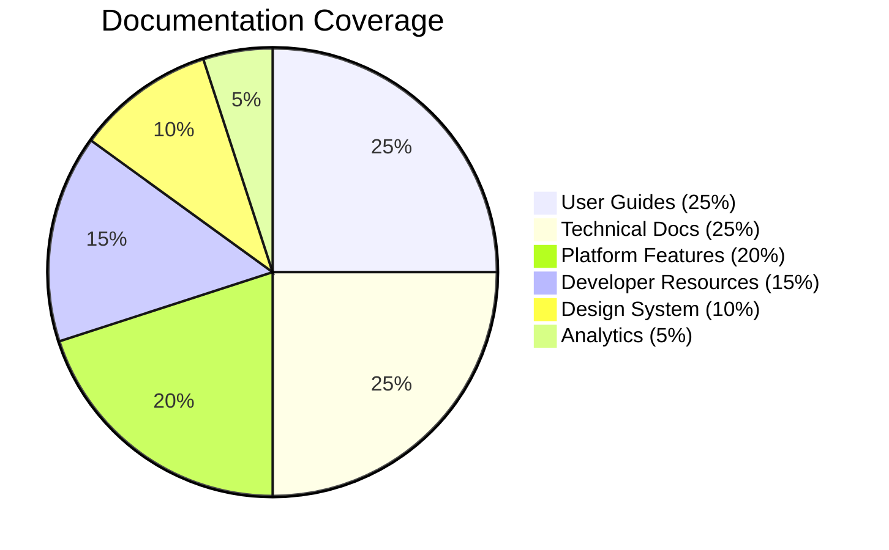

# Akkuea Documentation

_Empowering education through the strategic use of emerging technology_

---

## 🦅 About This Documentation

Welcome to the comprehensive documentation for Akkuea, the educational social platform that honors Costa Rica's indigenous heritage while building innovative learning experiences. This documentation is designed to be accessible, well-structured, and culturally sensitive.

---

## 📚 Documentation Structure

### Core Documentation

#### [📋 Documentation Index](index.md)

Complete navigation hub for all documentation sections with quick access links and overview information.

#### [🏗️ Platform Features](features/README.md)

Comprehensive overview of Akkuea's social networking capabilities, content interaction systems, and community features.

#### [📖 Educational Resources](educational-resources/README.md)

Detailed documentation of the content creation, sharing, and discovery systems that power educational collaboration.

#### [🛒 Marketplace](marketplace/README.md)

Complete guide to the designer-educator marketplace, including project workflows, payment systems, and quality assurance.

#### [🤖 AI Agents](ai-agents/README.md)

Documentation for native AI agent creation, training, and management systems that enable specialized educational assistance.

---

Issue 296

<!-- Make the changes from issue number 296 here. Thank you for contributing to Akkuea! -->

---

### Technical Documentation

#### [🏛️ System Architecture](technical/architecture.md)
Complete technical architecture overview including system design, technology stack, scalability patterns, and infrastructure details.

---

### Developer Resources

#### [⚙️ Development Setup](development/setup.md)
Comprehensive development environment setup guide with tooling, configuration, and troubleshooting information.

#### [🤝 Contributing Guidelines](development/contributing.md)
Complete contributor guide including code of conduct, development workflows, cultural sensitivity guidelines, and community recognition programs.

---

### Design System

#### [🎨 Visual Identity](design/visual-identity.md)
Brand guidelines, color systems, typography standards, and cultural design principles that maintain Akkuea's authentic visual language.

---

Issue 300

<!-- Make the changes from issue number 300 here. Thank you for contributing to Akkuea! -->

---

Issue 301

<!-- Make the changes from issue number 301 here. Thank you for contributing to Akkuea! -->

---

## 📊 Documentation Statistics

---

Issue 303

<!-- Make the changes from issue number 303 here. Thank you for contributing to Akkuea! -->

---

Issue 304

<!-- Make the changes from issue number 304 here. Thank you for contributing to Akkuea! -->

---

Issue 305

<!-- Make the changes from issue number 305 here. Thank you for contributing to Akkuea! -->

---

Issue 306

<!-- Make the changes from issue number 306 here. Thank you for contributing to Akkuea! -->

---

Issue 307

## 📞 Support & Feedback

### Documentation Feedback
- **GitHub Issues**: Report documentation problems or suggestions
- **Community Discord**: Discuss documentation in #docs channel
- **Cultural Council**: Provide feedback on cultural representation
- **User Testing**: Participate in documentation usability testing

### Getting Help
- **Search**: Use documentation search for quick answers
- **Community**: Ask questions in appropriate channels
- **Mentorship**: Connect with experienced community members
- **Office Hours**: Join weekly documentation Q&A sessions

---

## 🙏 Acknowledgments

This documentation represents the collaborative effort of:
- **Akkuea Development Team**: Technical implementation and architecture
- **Cultural Advisors**: Cabecar community elders and cultural experts
- **Educational Consultants**: Pedagogy experts and learning specialists
- **Community Contributors**: Platform users and content creators
- **Design Team**: Visual identity and user experience designers

*Special recognition to the Cabecar people whose cultural heritage inspires the name "Akkuea" (Hawk) and whose wisdom guides our approach to respectful cultural integration in educational technology.*

---

*This documentation is a living resource that grows with our community. Your contributions, feedback, and cultural insights help make Akkuea a more effective and respectful educational platform.*

---

*¡Pura Vida! Welcome to the Akkuea community! 🇨🇷*

