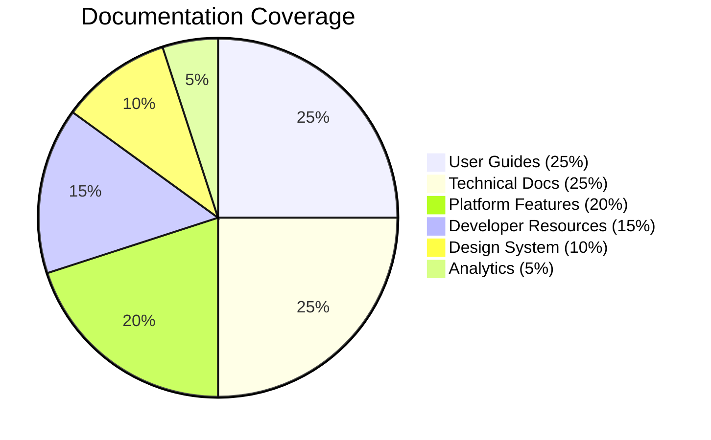

# Akkuea Documentation

*Empowering education through the strategic use of emerging technology*

---

Issue 294
<!-- Make the changes from issue number 294 here. Thank you for contributing to Akkuea! -->

---

## 📚 Documentation Structure

### Core Documentation

#### [📋 Documentation Index](index.md)
Complete navigation hub for all documentation sections with quick access links and overview information.

#### [🏗️ Platform Features](features/README.md)
Comprehensive overview of Akkuea's social networking capabilities, content interaction systems, and community features.

#### [📖 Educational Resources](educational-resources/README.md)
Detailed documentation of the content creation, sharing, and discovery systems that power educational collaboration.

#### [🛒 Marketplace](marketplace/README.md)
Complete guide to the designer-educator marketplace, including project workflows, payment systems, and quality assurance.

#### [🤖 AI Agents](ai-agents/README.md)
Documentation for native AI agent creation, training, and management systems that enable specialized educational assistance.

---

Issue 296
<!-- Make the changes from issue number 296 here. Thank you for contributing to Akkuea! -->

---

Issue 297
<!-- Make the changes from issue number 297 here. Thank you for contributing to Akkuea! -->

---

Issue 298
<!-- Make the changes from issue number 298 here. Thank you for contributing to Akkuea! -->

---

Issue 299
<!-- Make the changes from issue number 299 here. Thank you for contributing to Akkuea! -->

---

Issue 300
<!-- Make the changes from issue number 300 here. Thank you for contributing to Akkuea! -->

---

Issue 301
<!-- Make the changes from issue number 301 here. Thank you for contributing to Akkuea! -->

---

## 📊 Documentation Statistics

---

Issue 303
<!-- Make the changes from issue number 303 here. Thank you for contributing to Akkuea! -->

---

Issue 304
<!-- Make the changes from issue number 304 here. Thank you for contributing to Akkuea! -->

---

Issue 305
<!-- Make the changes from issue number 305 here. Thank you for contributing to Akkuea! -->

---

Issue 306
<!-- Make the changes from issue number 306 here. Thank you for contributing to Akkuea! -->

---

Issue 307
<!-- Make the changes from issue number 307 here. Thank you for contributing to Akkuea! -->

---

Issue 308
<!-- Make the changes from issue number 308 here. Thank you for contributing to Akkuea! -->

