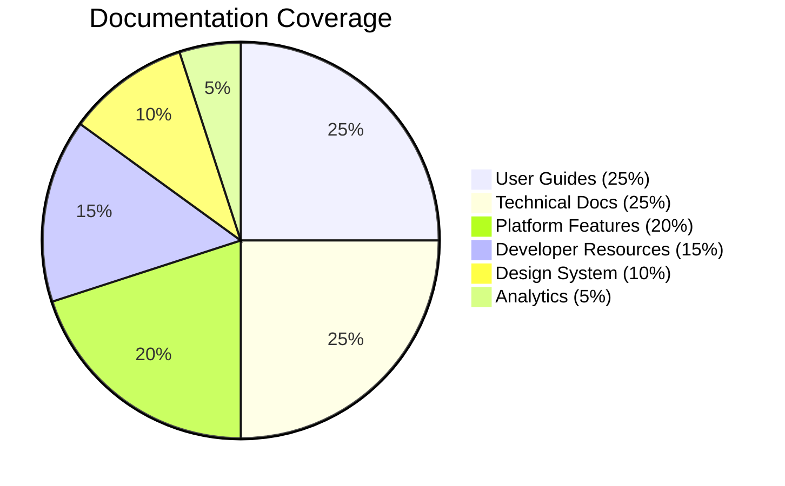

# Akkuea Documentation

_Empowering education through the strategic use of emerging technology_

---

Issue 294

<!-- Make the changes from issue number 294 here. Thank you for contributing to Akkuea! -->

---

Issue 295

<!-- Make the changes from issue number 295 here. Thank you for contributing to Akkuea! -->

---

Issue 296

<!-- Make the changes from issue number 296 here. Thank you for contributing to Akkuea! -->

---

Issue 297

<!-- Make the changes from issue number 297 here. Thank you for contributing to Akkuea! -->

---

Issue 298

<!-- Make the changes from issue number 298 here. Thank you for contributing to Akkuea! -->

---

Issue 299

<!-- Make the changes from issue number 299 here. Thank you for contributing to Akkuea! -->

---

Issue 300

<!-- Make the changes from issue number 300 here. Thank you for contributing to Akkuea! -->

---

Issue 301

<!-- Make the changes from issue number 301 here. Thank you for contributing to Akkuea! -->

---

## 📊 Documentation Statistics

---

Issue 303

<!-- Make the changes from issue number 303 here. Thank you for contributing to Akkuea! -->

---

Issue 304

<!-- Make the changes from issue number 304 here. Thank you for contributing to Akkuea! -->

---

Issue 305

<!-- Make the changes from issue number 305 here. Thank you for contributing to Akkuea! -->

---

Issue 306

<!-- Make the changes from issue number 306 here. Thank you for contributing to Akkuea! -->

---

Issue 307

<!-- Make the changes from issue number 307 here. Thank you for contributing to Akkuea! -->

---

Issue 308

<!-- Make the changes from issue number 308 here. Thank you for contributing to Akkuea! -->
