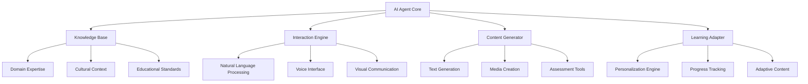
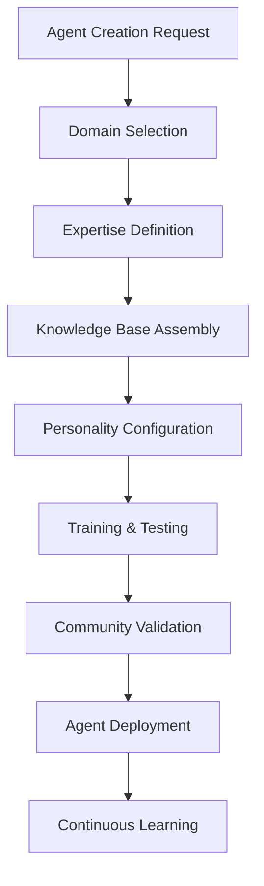
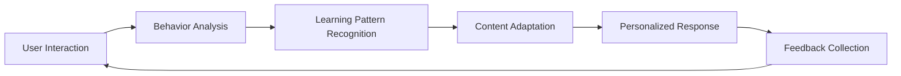
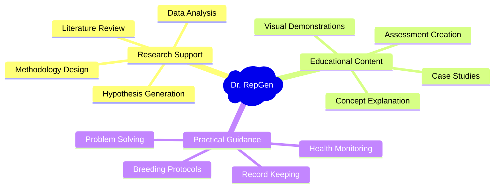
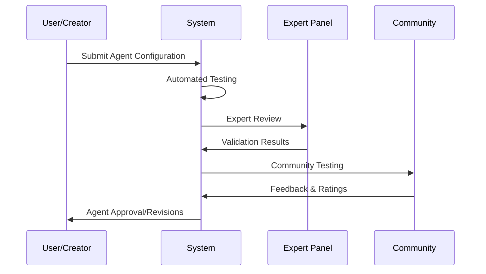
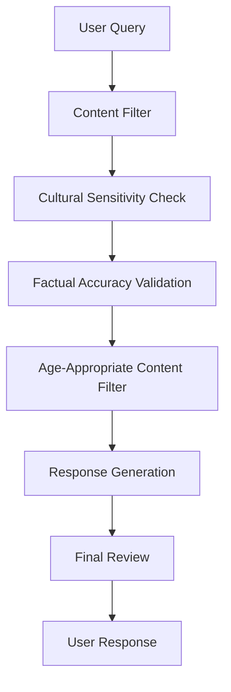
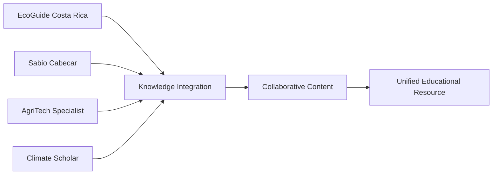
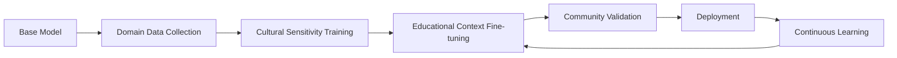

# AI Agents System

---

## Overview

The AI Agents System represents Akkuea's cutting-edge approach to educational technology, enabling users to create specialized artificial intelligence agents directly within the platform. These agents serve as intelligent assistants, content creators, and domain experts that can interact with users, generate educational materials, and provide personalized learning experiences.

---

## Agent Architecture

### Core Components

---

### Agent Types & Specializations

#### Academic Subject Specialists

| Domain          | Example Agent                | Capabilities                                                |
| --------------- | ---------------------------- | ----------------------------------------------------------- |
| **STEM**        | Dr. Genome (Genetics Expert) | Research analysis, experiment design, data interpretation   |
| **Mathematics** | Prof. Calculus               | Problem solving, proof generation, visualization            |
| **History**     | Chronicler Costa Rica        | Historical analysis, timeline creation, cultural context    |
| **Languages**   | Polyglot Tutor               | Grammar correction, conversation practice, cultural nuances |

#### Cultural Heritage Experts

| Focus Area               | Agent Example          | Specialized Knowledge                                       |
| ------------------------ | ---------------------- | ----------------------------------------------------------- |
| **Indigenous Knowledge** | Sabio Cabecar          | Traditional practices, oral histories, cultural protocols   |
| **Local History**        | Guardian of El Gavilan | Regional traditions, community stories, historical events   |
| **Biodiversity**         | EcoGuide Costa Rica    | Native species, conservation, ecological relationships      |
| **Traditional Arts**     | Artisan Master         | Craft techniques, cultural significance, skill transmission |

#### Research & Innovation Specialists

| Research Domain            | Agent Profile        | Research Capabilities                                              |
| -------------------------- | -------------------- | ------------------------------------------------------------------ |
| **Genetic Improvement**    | Dr. RepGen           | Disease resistance research, breeding protocols, genetic analysis  |
| **Educational Technology** | EdTech Innovator     | Learning analytics, technology integration, pedagogical research   |
| **Climate Science**        | Climate Scholar      | Environmental data analysis, adaptation strategies, sustainability |
| **Social Sciences**        | Community Researcher | Cultural studies, social dynamics, community development           |

---

## Agent Creation Workflow

### User-Friendly Agent Builder

---

#### Step 1: Domain Selection
**Available Templates**:
- Academic Subject Expert
- Cultural Heritage Specialist  
- Research Professional
- Creative Arts Mentor
- Technical Skills Instructor
- Community Knowledge Keeper

---

#### Step 2: Expertise Configuration

| Configuration Area       | Options                                        | Customization Level      |
| ------------------------ | ---------------------------------------------- | ------------------------ |
| **Knowledge Depth**      | Beginner, Intermediate, Expert, Research-level | Granular control         |
| **Cultural Context**     | Regional, National, Indigenous, Global         | Multiple selections      |
| **Language Preferences** | Spanish, English, Indigenous languages         | Multilingual support     |
| **Communication Style**  | Formal, Conversational, Educational, Inspiring | Personality traits       |
| **Interaction Modes**    | Text, Voice, Visual, Interactive               | Multi-modal capabilities |

---

#### Step 3: Knowledge Base Integration

**Data Sources**:

- Curated educational content from Akkuea platform
- Verified academic publications and research
- Cultural documentation and oral histories
- User-contributed specialized knowledge
- Real-time data feeds and updates

---

### Advanced Agent Features

#### Adaptive Learning Capabilities

#### Multi-Modal Communication
| Mode | Description | Use Cases |
|------|-------------|-----------|
| **Text Chat** | Natural language conversation | Q&A sessions, explanations, guidance |
| **Voice Interaction** | Speech-to-speech communication | Language practice, accessibility support |
| **Visual Communication** | Diagrams, charts, illustrations | Complex concept explanation |
| **Interactive Demos** | Hands-on learning experiences | Skill practice, simulation exercises |

---

## Specialized Agent Examples

### Dr. RepGen: Genetic Improvement Specialist

#### Agent Profile
**Expertise**: Disease resistance in reptiles, genetic improvement protocols, breeding program optimization

**Knowledge Base Components**:
- Reptilian genetics and genomics
- Disease pathology and resistance mechanisms  
- Breeding program design and management
- Conservation genetics principles
- Statistical analysis for genetic research

**Interaction Capabilities**:

---

#### Sample Interactions

## **Research Query Example**:

User: "What genetic markers should I look for when selecting breeding pairs for improved disease resistance in green iguanas?"

Dr. RepGen: "For green iguana disease resistance breeding, focus on these key genetic markers:

1. **MHC Class II genes**: Associated with immune response diversity
2. **TLR4 variants**: Toll-like receptor for pathogen recognition
3. **IL-10 polymorphisms**: Anti-inflammatory response regulation

## I recommend screening for heterozygosity in these regions to maximize immune system diversity. Would you like me to explain the specific testing protocols or breeding strategies for optimizing these markers?"

---

### Sabio Cabecar: Indigenous Knowledge Keeper

#### Agent Profile
**Expertise**: Cabecar cultural traditions, indigenous ecological knowledge, traditional healing practices, oral history preservation

**Cultural Sensitivity Framework**:
- Community permission protocols
- Sacred knowledge protection
- Appropriate cultural representation
- Elder validation requirements

**Knowledge Domains**:
| Domain | Content Areas | Sensitivity Level |
|--------|---------------|------------------|
| **Traditional Medicine** | Medicinal plants, healing practices | High - Elder approval required |
| **Ecological Knowledge** | Traditional farming, biodiversity | Medium - Community guidance |
| **Cultural Practices** | Ceremonies, crafts, stories | High - Sacred elements protected |
| **Language Preservation** | Cabecar language, oral traditions | Medium - Educational use permitted |

---

#### Sample Educational Content Generation
**Traditional Ecological Knowledge Module**:
---
Generated Content: "Traditional Cabecar Farming Practices"

Section 1: Seasonal Planting Cycles
- Aligned with lunar calendars and natural indicators
- Crop rotation principles based on soil health
- Integration with forest ecosystems

Section 2: Companion Planting Wisdom
- Traditional polyculture systems
- Natural pest management through biodiversity
- Soil conservation techniques

[Note: Content generated in collaboration with Cabecar community representatives and validated by cultural experts]

---

## Agent Management & Governance

### Quality Assurance Framework

#### Agent Validation Process

---

#### Continuous Monitoring

| Metric                        | Measurement                 | Quality Threshold          |
| ----------------------------- | --------------------------- | -------------------------- |
| **Response Accuracy**         | Expert validation score     | >95% accuracy              |
| **Cultural Sensitivity**      | Community feedback rating   | >4.5/5.0                   |
| **Educational Effectiveness** | Learning outcome assessment | >80% objective achievement |
| **User Satisfaction**         | User rating and engagement  | >4.7/5.0                   |

### Ethical Guidelines & Safety Measures

#### AI Ethics Framework

- **Transparency**: Clear indication of AI-generated content
- **Bias Prevention**: Regular bias auditing and correction
- **Cultural Respect**: Indigenous knowledge protection protocols
- **Educational Integrity**: Fact-checking and source attribution
- **Privacy Protection**: User data anonymization and security

---

#### Safety Mechanisms

    
---

## Agent Collaboration Network

### Multi-Agent Interactions

#### Collaborative Problem Solving

**Example Scenario**: Creating comprehensive educational content about sustainable agriculture in Costa Rica

---

#### Agent Specialization Synergy
| Primary Agent | Collaborating Agents | Output Enhancement |
|---------------|---------------------|-------------------|
| **Dr. RepGen** | EcoGuide, Climate Scholar | Genetic research with environmental context |
| **Sabio Cabecar** | Community Researcher, Artisan Master | Cultural preservation with modern documentation |
| **Prof. Calculus** | EdTech Innovator, Visual Designer | Mathematical concepts with interactive visualization |

---

### Community Agent Ecosystem.

#### User-Created Agent Network
- **Public Agent Directory**: Searchable catalog of available agents
- **Agent Rating System**: Community-driven quality assessment
- **Collaboration Requests**: Users can request agent partnerships
- **Knowledge Sharing**: Agents learn from each other's interactions

---

#### Contribution Recognition

| Contribution Type          | Recognition                         | Reward Mechanism           |
| -------------------------- | ----------------------------------- | -------------------------- |
| **Agent Creation**         | Creator badge, platform recognition | Premium features access    |
| **Knowledge Contribution** | Expert contributor status           | Marketplace benefits       |
| **Community Validation**   | Validator recognition               | Special privileges         |
| **Cultural Consultation**  | Cultural expert badge               | Consultation opportunities |

---

## Technical Implementation

### AI Model Architecture

#### Foundation Models

- **Large Language Models**: GPT-4, Claude, Llama for natural language processing
- **Multimodal Models**: DALL-E, Midjourney for visual content generation
- **Speech Models**: Whisper for voice interaction capabilities
- **Specialized Models**: Domain-specific fine-tuned models for accuracy

---

#### Training Pipeline

---

#### Performance Optimization

| Optimization Area      | Technique                      | Expected Improvement             |
| ---------------------- | ------------------------------ | -------------------------------- |
| **Response Speed**     | Model compression, caching     | 50% faster responses             |
| **Accuracy**           | Retrieval-augmented generation | 25% accuracy improvement         |
| **Cultural Relevance** | Local data integration         | 40% better context understanding |
| **Personalization**    | User behavior modeling         | 60% more relevant content        |

---

## Future Roadmap

### Phase 1: Foundation (Q1 2026)

- ⏳ Basic agent creation framework
- ⏳ Template-based agent builder
- ⏳ Initial domain specializations
- ⏳ Community validation system

### Phase 2: Enhancement (Q2 2026)

- ⏳ Advanced natural language capabilities
- ⏳ Multi-modal interaction support
- ⏳ Collaborative agent networks
- ⏳ Cultural knowledge integration

### Phase 3: Innovation (Q3 2026)

- ⏳ Real-time learning adaptation
- ⏳ Cross-platform agent deployment
- ⏳ Advanced personalization
- ⏳ Research automation tools

### Phase 4: Ecosystem (Q4 2026)

- ⏳ Agent marketplace
- ⏳ Third-party integrations
- ⏳ Global knowledge network
- ⏳ Advanced analytics dashboard
