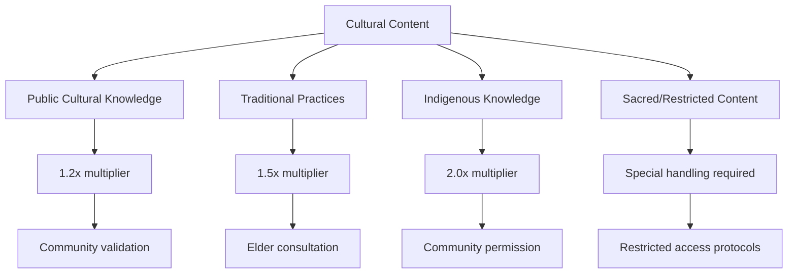
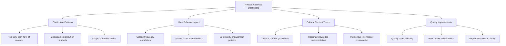
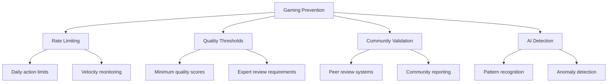
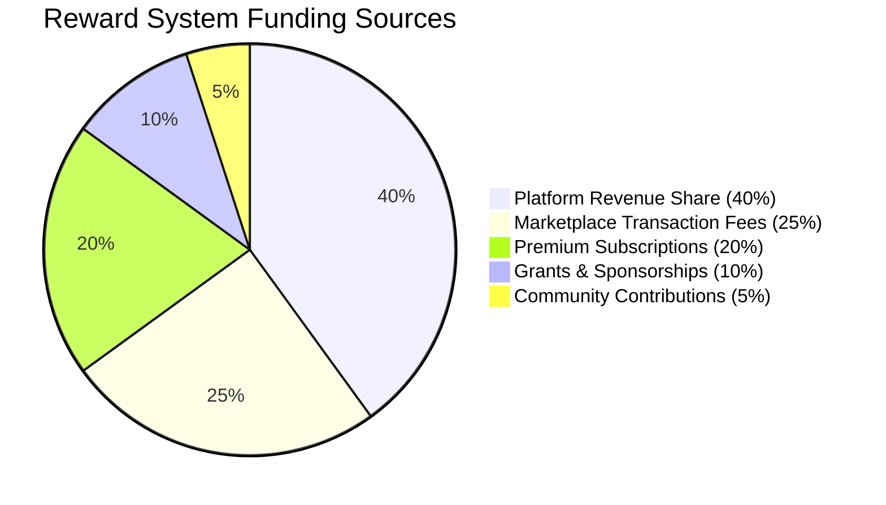

# Reward System Analytics


## Overview

The Akkuea Reward System is designed to incentivize high-quality educational content creation, meaningful community engagement, and cultural knowledge preservation. This system recognizes contributors who add educational value while maintaining cultural sensitivity and platform standards.


---

## Reward Calculation Framework

### Core Metrics Algorithm

```mermaid
flowchart TD
    A[User Action] --> B[Base Points Calculation]
    B --> C[Quality Multipliers]
    C --> D[Cultural Bonus]
    D --> E[Community Impact Factor]
    E --> F[Time Decay Adjustment]
    F --> G[Final Reward Points]

    B --> B1[Content Upload: 10 pts]
    B --> B2[Content Download: 1 pt]
    B --> B3[Positive Rating: 5 pts]
    B --> B4[Comment/Discussion: 2 pts]

    C --> C1[Quality Score × 2]
    C --> C2[Expert Endorsement × 5]
    C --> C3[Completion Rate × 1.5]

    D --> D1[Cultural Heritage: 1.5×]
    D --> D2[Indigenous Knowledge: 2×]
    D --> D3[Local Traditions: 1.3×]

    E --> E1[Views Impact: log(views/100)]
    E --> E2[Engagement Rate × 3]
    E --> E3[Educational Outcomes × 4]
```

---


### Point Categories & Values

#### Content Creation Rewards
| Action | Base Points | Quality Multiplier | Maximum Points |
|--------|-------------|-------------------|----------------|
| **Educational Resource Upload** | 10 | 1x - 5x | 50 |
| **Interactive Content Creation** | 15 | 1x - 5x | 75 |
| **Cultural Heritage Documentation** | 20 | 1.5x - 7.5x | 150 |
| **AI Agent Creation** | 25 | 1x - 4x | 100 |
| **Collaborative Project** | 30 | 1x - 3x | 90 |

#### Community Engagement Rewards
| Action | Base Points | Frequency Limit | Notes |
|--------|-------------|----------------|-------|
| **Resource Download** | 1 | No limit | Per unique user |
| **Helpful Comment** | 2 | 50/day | Community-validated |
| **Quality Rating** | 3 | 20/day | Weighted by reviewer credibility |
| **Discussion Participation** | 5 | 10/day | Substantial contributions only |
| **Mentoring Activity** | 10 | 5/week | Verified mentorship interactions |


---


#### Special Achievements
| Achievement | Points | Criteria | Frequency |
|-------------|--------|----------|-----------|
| **First Upload Bonus** | 25 | First content upload | One-time |
| **Cultural Steward** | 50 | 10+ cultural content pieces | Monthly |
| **Community Builder** | 75 | 100+ helpful interactions | Quarterly |
| **Innovation Leader** | 100 | Breakthrough feature/content | As earned |
| **Cultural Ambassador** | 150 | Community recognition + elder endorsement | Annually |


---

Issue 395

---

Issue 396

---

Issue 397

---


## Cultural Heritage Bonus System

### Cultural Content Classification

#### Cultural Significance Levels



---

Issue 399

### Cultural Impact Measurement

#### Community Benefit Assessment
| Indicator | Measurement | Weight | Target Value |
|-----------|-------------|--------|--------------|
| **Knowledge Preservation** | Content archival rate | 25% | 90%+ preserved |
| **Educational Access** | Download/usage statistics | 25% | 1000+ learners reached |
| **Cultural Continuity** | Intergenerational transmission | 20% | 3+ generations engaged |
| **Community Recognition** | Elder/leader endorsements | 20% | 5+ community endorsements |
| **Global Awareness** | International engagement | 10% | 10+ countries accessing |


Issue 401

---

Issue 402

### Level Benefits & Privileges

| Level | Points Required | Benefits | Responsibilities |
|-------|----------------|----------|------------------|
| **Novice** | 0-100 | Basic access, learning features | Follow community guidelines |
| **Contributor** | 101-500 | Upload content, basic marketplace | Quality content creation |
| **Educator** | 501-1500 | Advanced tools, AI agent creation | Mentor newcomers |
| **Expert** | 1501-3000 | Content moderation, expert badges | Community leadership |
| **Master** | 3001-6000 | Platform governance, feature preview | Strategic guidance |
| **Guardian** | 6000+ | Cultural stewardship, elder council | Cultural preservation leadership |

---

Issue 403

### Progression Incentives

#### Monthly Challenges
| Challenge Type | Points Reward | Criteria | Cultural Focus |
|----------------|---------------|----------|----------------|
| **Knowledge Keeper** | 50-200 | Document local traditions | Varies by region |
| **Bridge Builder** | 75-150 | Cross-cultural content creation | International collaboration |
| **Innovation Pioneer** | 100-300 | Create new educational tools | Technology + culture |
| **Community Weaver** | 25-100 | Foster community connections | Social engagement |

## Reward Distribution Mechanisms 
 
 ### Point-to-Benefit Conversion 
 
 #### Platform Currency Exchange 
 ```mermaid 
 flowchart LR 
     A[Reward Points] --> B[Platform Credits] 
     A --> C[Marketplace Benefits] 
     A --> D[Recognition Badges] 
     A --> E[Physical Rewards] 
     
     B --> B1[Premium Features] 
     B --> B2[Storage Upgrades] 
     B --> B3[Advanced Analytics] 
     
     C --> C1[Design Commission Credits] 
     C --> C2[Priority Project Placement] 
     C --> C3[Reduced Marketplace Fees] 
     
     D --> D1[Profile Badges] 
     D --> D2[Leaderboard Recognition] 
     D --> D3[Certificate Generation] 
     
     E --> E1[Cultural Artifacts] 
     E --> E2[Conference Tickets] 
     E --> E3[Educational Materials]
```


---

Issue 405

#### Conversion Rates
| Reward Type | Point Cost | Real Value | Availability |
|-------------|------------|------------|--------------|
| **Platform Credits** | 10 points = $1 USD | Direct conversion | Unlimited |
| **Marketplace Credits** | 15 points = $1 USD | Design commissions | Monthly limit |
| **Premium Features** | 500 points | $25/month value | 1 month access |
| **Conference Tickets** | 2000 points | $200-500 value | Limited quantity |
| **Cultural Artifacts** | 1000-5000 points | $50-300 value | Community-created |

---


### Recognition Programs

#### Public Recognition
| Recognition Type | Trigger | Visibility | Duration |
|------------------|---------|------------|----------|
| **Top Contributor** | Monthly leaderboard top 10 | Platform-wide | 1 month |
| **Cultural Ambassador** | Exceptional cultural content | Community newsletter | Permanent |
| **Innovation Award** | Breakthrough contribution | Platform homepage | 3 months |
| **Community Hero** | Outstanding mentorship | Profile badge | Permanent |

---


#### Professional Recognition
- **LinkedIn Badge Integration**: Verified Akkuea contributor credentials
- **Academic Citations**: Contribution recognition in research papers
- **Speaking Opportunities**: Conference presentations and workshops
- **Consulting Opportunities**: Cultural and educational consulting projects

---


## Analytics & Insights

### Reward System Performance Metrics

#### Key Performance Indicators
| Metric | Current Target | Measurement Method | Frequency |
|--------|----------------|-------------------|-----------|
| **User Engagement** | 75% monthly active | Platform analytics | Daily |
| **Content Quality** | 4.2/5.0 average | Community ratings | Weekly |
| **Cultural Content Growth** | 25% quarterly | Content categorization | Monthly |
| **Community Satisfaction** | 85% positive | User surveys | Quarterly |
| **Reward Distribution Equity** | Gini coefficient <0.3 | Statistical analysis | Monthly |

---


#### Reward Distribution Analysis


---


### Behavioral Impact Analysis

#### Positive Behavioral Incentives
| Behavior | Reward Mechanism | Measured Impact | Optimization |
|----------|------------------|-----------------|--------------|
| **High-Quality Content** | Quality multipliers | 85% quality improvement | Adjust multiplier weights |
| **Cultural Sensitivity** | Cultural bonuses | 92% cultural validation rate | Expand cultural expert network |
| **Community Mentorship** | Special recognition | 78% new user retention | Enhance mentor training |
| **Innovation** | Innovation awards | 45% feature adoption | Increase innovation rewards |

---


#### Preventing Gaming & Abuse

##### Anti-Gaming Measures


---


##### Detection Systems
| Gaming Attempt | Detection Method | Penalty | Prevention |
|----------------|------------------|---------|------------|
| **Vote Manipulation** | Pattern analysis | Point deduction + suspension | Rate limiting |
| **Content Spam** | Quality filters | Content removal + points loss | Quality thresholds |
| **Fake Engagement** | Behavioral analysis | Account restriction | Community validation |
| **Cultural Misappropriation** | Expert review | Severe penalties | Cultural expert oversight |

---


## Economic Sustainability

### Revenue Integration

#### Sustainable Reward Funding

---


#### Cost-Benefit Analysis
| Component              | Monthly Cost | Value Generated                | ROI  |
|------------------------|--------------|--------------------------------|------|
| **Point Distribution** | $5,000       | $15,000 (content value)        | 300% |
| **Recognition Programs** | $2,000     | $8,000 (engagement value)      | 400% |
| **Cultural Bonuses** | $3,000         | $12,000 (preservation value)   | 400% |
| **Innovation Rewards** | $4,000       | $20,000 (platform improvement) | 500% |

---


### Long-term Sustainability

#### Scaling Considerations
- **Inflation Protection**: Point values adjusted for platform growth
- **Quality Maintenance**: Reward distribution based on sustained quality
- **Cultural Authenticity**: Continued community involvement and validation
- **Economic Balance**: Sustainable reward-to-cost ratios

#### Future Enhancements
- **AI-Powered Quality Assessment**: Automated initial quality scoring
- **Blockchain Integration**: Transparent, immutable reward tracking
- **Cross-Platform Recognition**: Integration with external educational platforms
- **Dynamic Reward Adjustment**: Machine learning-optimized reward algorithms


---


## Implementation Guidelines

### Technical Requirements
- Real-time point calculation and distribution
- Fraud detection and prevention systems
- Cultural validation workflow integration
- Analytics dashboard for monitoring and optimization

---


### Cultural Requirements
- Community elder advisory board for cultural content
- Regular cultural sensitivity training for moderators
- Transparent cultural bonus criteria and application
- Community feedback integration for continuous improvement

*The Akkuea Reward System creates a sustainable ecosystem that recognizes valuable contributions while preserving and celebrating cultural heritage through education.*

---

*Next: [Engagement Metrics](engagement-metrics.md)*
