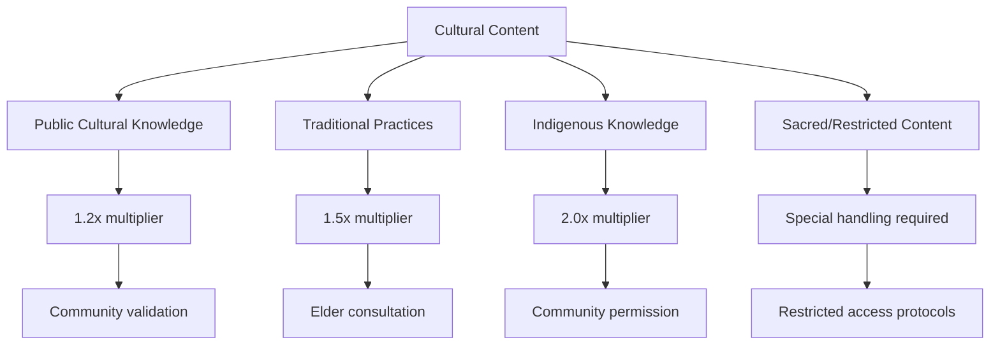

# Reward System Analytics

Issue 391

---

## Reward Calculation Framework

### Core Metrics Algorithm

```mermaid
flowchart TD
    A[User Action] --> B[Base Points Calculation]
    B --> C[Quality Multipliers]
    C --> D[Cultural Bonus]
    D --> E[Community Impact Factor]
    E --> F[Time Decay Adjustment]
    F --> G[Final Reward Points]
    
    B --> B1[Content Upload: 10 pts]
    B --> B2[Content Download: 1 pt]
    B --> B3[Positive Rating: 5 pts]
    B --> B4[Comment/Discussion: 2 pts]
    
    C --> C1[Quality Score × 2]
    C --> C2[Expert Endorsement × 5]
    C --> C3[Completion Rate × 1.5]
    
    D --> D1[Cultural Heritage: 1.5×]
    D --> D2[Indigenous Knowledge: 2×]
    D --> D3[Local Traditions: 1.3×]
    
    E --> E1[Views Impact: log(views/100)]
    E --> E2[Engagement Rate × 3]
    E --> E3[Educational Outcomes × 4]
```

---

Issue 393

---

Issue 394

---

Issue 395

---

Issue 396

---

Issue 397

---


## Cultural Heritage Bonus System

### Cultural Content Classification

#### Cultural Significance Levels



---

Issue 399

---

Issue 400

---

Issue 401

---

Issue 402

---

Issue 403

---

Issue 404

---

Issue 405

---

Issue 406

---

Issue 407

---

Issue 408

---

Issue 409

---

Issue 410

---

Issue 411

---

Issue 412

---

Issue 413

---


#### Cost-Benefit Analysis
| Component              | Monthly Cost | Value Generated                | ROI  |
|------------------------|--------------|--------------------------------|------|
| **Point Distribution** | $5,000       | $15,000 (content value)        | 300% |
| **Recognition Programs** | $2,000     | $8,000 (engagement value)      | 400% |
| **Cultural Bonuses** | $3,000         | $12,000 (preservation value)   | 400% |
| **Innovation Rewards** | $4,000       | $20,000 (platform improvement) | 500% |

---


### Long-term Sustainability

#### Scaling Considerations
- **Inflation Protection**: Point values adjusted for platform growth
- **Quality Maintenance**: Reward distribution based on sustained quality
- **Cultural Authenticity**: Continued community involvement and validation
- **Economic Balance**: Sustainable reward-to-cost ratios

#### Future Enhancements
- **AI-Powered Quality Assessment**: Automated initial quality scoring
- **Blockchain Integration**: Transparent, immutable reward tracking
- **Cross-Platform Recognition**: Integration with external educational platforms
- **Dynamic Reward Adjustment**: Machine learning-optimized reward algorithms


---


## Implementation Guidelines

### Technical Requirements
- Real-time point calculation and distribution
- Fraud detection and prevention systems
- Cultural validation workflow integration
- Analytics dashboard for monitoring and optimization

---

Issue 417

### Cultural Requirements
- Community elder advisory board for cultural content
- Regular cultural sensitivity training for moderators
- Transparent cultural bonus criteria and application
- Community feedback integration for continuous improvement

*The Akkuea Reward System creates a sustainable ecosystem that recognizes valuable contributions while preserving and celebrating cultural heritage through education.*

---

*Next: [Engagement Metrics](engagement-metrics.md)*

